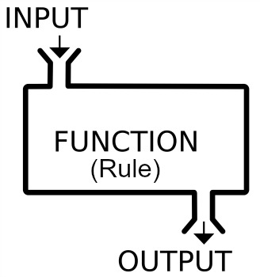

# Omschrijving
Een functie kan verschillende inputs en outputs hebben.



De parameters zijn de inputs van een functie.
Wat je returnt is de output van een functie.
Zowel de parameters als de return zijn optioneel. Een functie hoeft immers geen input en/of output te hebben.


### Voorbeeld
Stel je hebt een functie die aan de hand van de diameter, de oppervlakte en de omtrek van een cirkel bepaalt. \
`inputs`: diameter van een cirkel \
`outputs`: oppervlakte en omtrek

```python

def bepaal_oppervlakte_en_omtrek(diameter):
    straal = diameter / 2
    opp = 3.14 * (straal ** 2)
    omtr = 2 * 3.14 * straal

    return opp, omtr # de outputs van onze functie

oppervlakte, omtrek = bepaal_oppervlakte_en_omtrek(10)
print(f'oppervlakte = {oppervlakte} en omtrek = {omtrek}')
```

Output
```bash
> oppervlakte = 314 en omtrek = 62.8
```


Maak een functie die het volume van een kubus berekent. \
`volume kubus = lengte * breedte * hoogte` \
Alle zijden van een kubus zijn even lang.  
Bereken vervolgens de volumes van kubussen van met zijden van lengte `5`, `10` en `20`.

## Nieuwe technieken
Return-statement in functies

## Verboden technieken
Binnenin de functie printen

## Verwachte uitkomst
```bash
> 125
> 1000
> 8000
```
